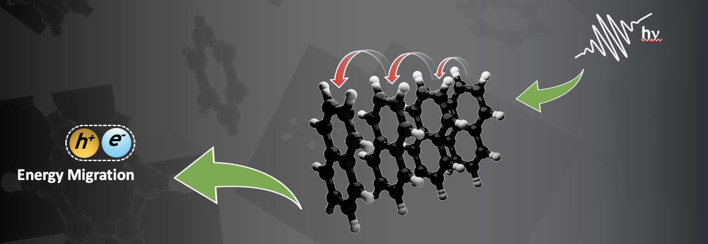

Welcome to exciton diffusion's documentation!
=============================================

**Exciton Diffusion** is a flexible open source Python tool for the simulation and examination of `exciton diffusion <https://ocw.mit.edu/courses/electrical-engineering-and-computer-science/6-973-organic-optoelectronics-spring-2003/lecture-notes/8.pdf>`_ in a variety of materials. The tool supports materials in the hopping regime and has the flexibility to extend to more complicated equations that describe the intermediate regime. The project includes simulations for point particles and can be expanded to include more physical systems, such as atoms in a crystal lattice. The project lives on GitHub at `Exciton Diffusion <https://github.com/savannahcarnahan/exciton_diffusion/>`_ and offers a *simple* and
*intuitive* API for usage and extension.

Module Usage
------------------
**Requirements:**
   * Python 3.6-3.8 on Linux.
   * Python 3.7-3.8 on Mac.
   
   | To get other requirements, run:
   | ``make``

**Running the Code**
   | To run the code, enter the command:
   | ``python driver.py input.txt output.txt``

   where **input.txt** is formatted as described below, and **output.txt** is a file that will contain the output.

**Input File**
   | The input file should consist of a first line of conditions, followed by a list of sites.
   | 
   | Conditions line should be of format:
   | ``&ltsystemtype&gt &ltdimension&gt &ltratetype&gt &ltmodeltype&gt &ltstarttime&gt &ltendtime&gt``
   |
   | Sites are of format:
   | ``&ltsitetype&gt &ltspecifications&gt coord1 coord2 coord3``

**Options**

   *systemtype*:  ``crystal``

   *dimension*:  ``1``,  ``2``,  ``3``

   *ratetype*: ``marcus``, ``arrhenius``

   *modeltype*:  ``kmc``

   *start/endtime are in picoseconds*

   *sitetype*:  ``pointparticle``,  ``molecule``
|
|

High-level Modules
==================
.. automodule:: driver
   :members:

.. automodule:: driver2
   :members:

.. automodule:: driver3
   :members:

.. automodule:: single
   :members:
|
|

Input/Output Modules
====================
.. automodule:: inputprocessor
   :members:

.. automodule:: com_line
   :members:

.. automodule:: interactive
   :members:

.. automodule:: xyz_inp
   :members:

.. automodule:: graphical_out
   :members:

|
|

Model Modules
=========================
.. automodule:: model_factory
   :members:

.. automodule:: model
   :members:

.. automodule:: kmc
   :members:
|
|

Probabilistic Rule Modules
=========================
.. automodule:: prob_rule_factory
   :members:

.. automodule:: prob_rule
   :members:

.. automodule:: arrhenius
   :members:

.. automodule:: fret
   :members:

.. automodule:: marcus
   :members:

.. automodule:: uniform
   :members:
|
|

System Modules
==================
.. automodule:: system_factory
   :members:

.. automodule:: system
   :members:

.. automodule:: dynamic
   :members:

.. automodule:: static
   :members:
|
|

Site Modules
==================
.. automodule:: site_factory
   :members:

.. automodule:: my_site
   :members:

.. automodule:: atom
   :members:

.. automodule:: molecule
   :members:

.. automodule:: crystal
   :members:

.. automodule:: pointparticle
   :members:

|
|
|

.. toctree::
   :maxdepth: 2
   :caption: Contents:

   index